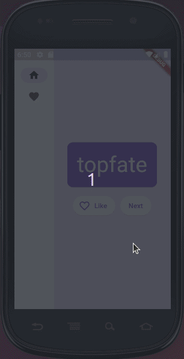

# namer_app

Este aplicativo foi desenvolvido com a finalidade de iniciar os estudos em Flutter com Dart.

## Sobre:
* o aplicativo gera nomes aleatórios; 
* o usuário pode solicitar o próximo nome; 
* favoritar o nome atual;
* revisar a lista de nomes favoritos em uma página separada;
* remover um ou mais nomes da lista de favoritos;

## Aprenda também
Se quiser mais detalhes de como fazer seu primeiro aplicativo em Flutter, sugiro:

- [Lab: Write your first Flutter app](https://docs.flutter.dev/get-started/codelab)
- [Cookbook: Useful Flutter samples](https://docs.flutter.dev/cookbook)

Para obter ajuda para começar com o desenvolvimento do Flutter, veja a 
[documentação](https://docs.flutter.dev/), que oferece tutoriais,
amostras, orientação sobre desenvolvimento e uma referência completa da API.
